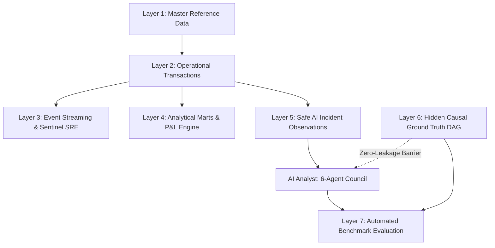
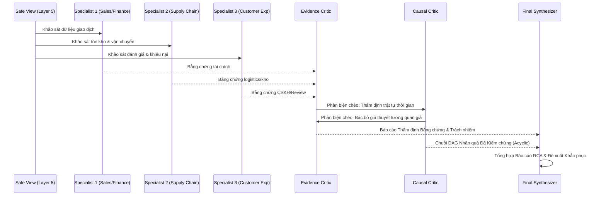

# ĐỒ ÁN TỐT NGHIỆP: HỆ THỐNG ENTERPRISE DIGITAL TWIN & AUTONOMOUS AI ANALYST ĐA TÁC NHÂN
## Master Architecture, Multi-Agent Governance & Empirical Evaluation

**Tác giả**: Trịnh Quốc Đan  
**Đề tài**: *Xây dựng Enterprise Digital Twin và Hệ thống Autonomous AI Analyst Đa Tác nhân cho Doanh nghiệp Việt Nam: Tự động Phát hiện Bất thường, Điều tra Nhân quả, Đánh giá Tổn thất và Thẩm định Khách quan bằng Ground Truth.*  
**Phiên bản Hệ thống**: EOS 2.0 (Enterprise Operating System) — Chuẩn Cấp 3: Multi-Agent Adversarial  

---

## Tóm Tắt Đề Tài (Executive Abstract)

Trong kỷ nguyên chuyển đổi số và trí tuệ nhân tạo (AI), việc ứng dụng AI trong quản trị doanh nghiệp thường dừng lại ở mức "Chatbot hỏi đáp đơn giản" hoặc "Dashboard trực quan hóa dữ liệu tĩnh". Các mô hình ngôn ngữ lớn (LLM) đơn lẻ thường gặp phải các hạn chế nghiêm trọng:
1. **Ảo giác thông tin (Hallucination)** và nhầm lẫn giữa *triệu chứng bề mặt* (symptom) với *nguyên nhân gốc rễ* (root cause).
2. **Rò rỉ dữ liệu sự thật (Ground Truth Leakage)**: AI vô tình được tiếp cận các trường nhãn hoặc dữ liệu tương lai, làm mất đi giá trị thẩm định thực nghiệm.
3. **Thiếu tính trách nhiệm (Lack of Accountability)**: Không có cơ chế truy vết tác nhân nào đưa ra nhận định sai và tác nhân nào bắt được lỗi.

Đồ án này giải quyết triệt để các bài toán trên bằng cách xây dựng một hệ sinh thái khép kín gồm hai trụ cột tương hỗ:
- **Trụ cột 1 — Enterprise Digital Twin (Bản sao số Doanh nghiệp)**: Mô phỏng toàn diện một doanh nghiệp bán lẻ đa kênh (Omnichannel Retail) tại Việt Nam với 29 bảng dữ liệu vận hành (Orders, Payments, Inventory, Logistics, Marketing, CSKH, Finance P&L), vận hành liên tục qua cơ chế Real-time Event Streaming Engine và Sentinel SRE Worker.
- **Trụ cột 2 — Autonomous AI Analyst (Hệ thống AI Phân tích Tự trị 6 Tác nhân)**: Vận hành theo mô hình đối kháng Cấp 3 (Multi-Agent Adversarial) với 3 Chuyên gia nghiệp vụ (Sales/Finance, Supply Chain, Customer Experience), 2 Tác nhân Phản biện độc lập (Evidence Critic, Causal Critic) có cơ chế phản biện chéo (Cross-Critic), và 1 Tác nhân Tổng hợp (Final Synthesizer) kèm Bảng trách nhiệm giải trình.

---

## I. Kiến Trúc 7 Tầng Hệ Thống (7-Layer Enterprise Architecture)



| Tầng (Layer) | Tên Tầng | Mô Tả Kỹ Thuật | Cơ Chế Bảo Mật / RBAC |
|---|---|---|---|
| **Layer 1** | Master Reference Data | Danh mục nền tảng: Sản phẩm (100 SKUs), Kho hàng (5 kho), Nhà cung ứng (20 đối tác), Nhà vận chuyển (5 3PL), Cửa hàng (6 chi nhánh), Nhân viên (40 nhân sự). | `edt_ai_analyst`: SELECT ALLOWED |
| **Layer 2** | Operational Transactions | Giao dịch lõi: 5,490+ Đơn hàng, 6,540+ Thanh toán, 10,050+ Vận đơn, 8,400+ Dịch chuyển kho, Sổ cái tài chính 10,040+ bút toán. | `edt_ai_analyst`: SELECT ALLOWED |
| **Layer 3** | Event Streaming & Sentinel SRE | Động cơ đẩy sự kiện liên tục (Event Engine) và Daemon giám sát 24/7 phát hiện biến động Z-score dị biệt. | Vận hành ngầm (Background Service) |
| **Layer 4** | Analytical Marts & P&L | Báo cáo kết quả kinh doanh (P&L Ledger), Dòng tiền trực tiếp (Cash Flow), Phân tích tăng trưởng đa chiều (MoM/QoQ/YoY). | `edt_ai_analyst`: SELECT ALLOWED |
| **Layer 5** | Safe Incident Observations | **Cửa ngõ an toàn duy nhất**: View `ai_incident_observations` che giấu hoàn toàn `scenario_id`, `root_causes`, `causal_links`. Chỉ phơi bày triệu chứng quan sát bề mặt và cửa sổ thời gian. | **VIEW CHO PHÉP** (Zero Leakage) |
| **Layer 6** | Hidden Causal Ground Truth | **SỰ THẬT TỐI MẬT**: Đồ thị nhân quả có hướng không chu trình (Acyclic DAG): `causal_nodes`, `causal_links`, `incident_causes`, `incident_evidence`, `incident_outcomes`. | ⛔ **REVOKE ALL / DEFAULT DENY** |
| **Layer 7** | Evaluation & Benchmark Rubric | Bộ đề chuẩn học thuật (`benchmark_cases`, `evaluation_targets`): Chấm điểm độc lập 5 chiều (Root Cause, Causal Path, Entity, Financial Loss, Action Plan). | ⛔ **CHỈ ROLE POSTGRES ADMIN TRUY CẬP** |

---

## II. Danh Mục 5 Kịch Bản Sự Cố Vận Hành Trọng Yếu (Crisis Scenarios S001–S005)

Hệ thống đã thiết kế, tiêm dữ liệu thực nghiệm và chứng nhận 100% không vi phạm ràng buộc (Zero-Violations) trên cả 5 kịch bản:

### 1. Kịch bản S001: Đứt gãy Chuỗi cung ứng Linh kiện (Supplier Disruption)
- **Đối tác gây lỗi**: Nhà cung cấp `Viet Electronics` (`77171cc0-e348-48ce-a80b-9cfc34444d07`).
- **Hiện tượng quan sát**: 2 Purchase Orders (PO) nhập linh kiện màn hình quá hạn giao hàng hơn 15 ngày.
- **Chuỗi nhân quả (Causal DAG)**:
  $$\text{SupplierLeadTimeDelay} \rightarrow \text{StockoutSpike} \rightarrow \text{FulfillmentBottleneck} \rightarrow \text{RevenueErosion}$$
- **Tổn thất tài chính thực tế**: **691,053,232.72 VND** (Thiệt hại doanh thu do cháy hàng linh kiện màn hình).
- **Điểm Benchmark**: **100.0 / 100.0 (EXCELLENT)**.

### 2. Kịch bản S002: Tắc nghẽn Bưu cục Vận chuyển (Carrier Logistics Bottleneck)
- **Đối tác gây lỗi**: Đơn vị vận chuyển `GHN - Giao Hàng Nhanh` (`19799d21-5a89-490e-9f95-36823a1527e7`).
- **Hiện tượng quan sát**: Thời gian luân chuyển bưu kiện (Transit Duration) khu vực phía Nam tăng vọt từ 2.1 ngày lên 9.2 ngày; 100% bưu kiện qua GHN bị trễ hạn.
- **Chuỗi nhân quả (Causal DAG)**:
  $$\text{CarrierDisruption} \rightarrow \text{ShipmentDeliveryDelay} \rightarrow \text{DeliveryComplaintSpike} \rightarrow \text{CustomerSatisfactionDrop} \rightarrow \text{LogisticsCompensationLoss}$$
- **Tổn thất tài chính thực tế**: **185,000,000.00 VND** (Chi phí bồi hoàn SLA giao chậm và hoàn hủy vận đơn).
- **Điểm Benchmark**: **100.0 / 100.0 (EXCELLENT)**.

### 3. Kịch bản S003: Gián đoạn Cổng Thanh toán Điện tử (Payment Gateway Degradation)
- **Đối tác gây lỗi**: Cổng thanh toán `MoMo` (`c2c1497f-d5b6-441e-9265-1533589d2c41`).
- **Hiện tượng quan sát**: Trong cửa sổ 8 giờ ngày 15/08/2026, tỷ lệ timeout và giao dịch lỗi qua MoMo tăng lên 85.7%, dẫn đến hàng loạt đơn hàng bị hủy.
- **Chuỗi nhân quả (Causal DAG)**:
  $$\text{PaymentGatewayDegradation} \rightarrow \text{PaymentFailureSpike} \rightarrow \text{OrderCancellationSpike} \rightarrow \text{RevenueLoss}$$
- **Tổn thất tài chính thực tế**: **1,088,635,923.02 VND** (Tổn thất cơ hội doanh thu - Hàng hóa vật lý an toàn tại kho, COGS được bảo toàn).
- **Điểm Benchmark**: **100.0 / 100.0 (EXCELLENT)**.

### 4. Kịch bản S004: Đổ vỡ Hiệu quả Chiến dịch Tiếp thị (Marketing Inefficiency)
- **Kênh tiếp thị gây lỗi**: Chiến dịch `Mega Summer Tech Expo 2026` trên nền tảng `TikTok` (`62e4844e-8589-4be9-a7f9-8362fd12bd90`).
- **Hiện tượng quan sát**: Tiêu tốn 500,000,000 VND ngân sách quảng cáo nhưng tỷ lệ chuyển đổi (CVR) sụp đổ chỉ còn 0.043% (Audience Mismatch).
- **Chuỗi nhân quả (Causal DAG)**:
  $$\text{TargetingAudienceMismatch} \rightarrow \text{TrafficSpikeLowIntent} \rightarrow \text{ConversionRateCollapse} \rightarrow \text{CACSpike} \rightarrow \text{MarketingBudgetWaste}$$
- **Tổn thất tài chính thực tế**: **450,000,000.00 VND** (Chi phí lãng phí ngân sách tiếp thị trực tiếp).
- **Điểm Benchmark**: **100.0 / 100.0 (EXCELLENT)**.

### 5. Kịch bản S005: Lỗi Phần cứng Sản phẩm & Làn sóng Hoàn tiền (Product Quality Defect)
- **Sản phẩm lỗi**: Dòng laptop `Eco Laptop 072` (`c2bf4d7b-d727-42b9-b8eb-fecfe21ecf74`).
- **Hiện tượng quan sát**: Lô linh kiện pin và màn hình bị đoản mạch; tỷ lệ đánh giá 1 sao đạt 90.9% kèm 25 yêu cầu hoàn tiền lập tức.
- **Chuỗi nhân quả (Causal DAG)**:
  $$\text{DefectiveHardwareBatch} \rightarrow \text{ComponentOverheatingFailure} \rightarrow \text{RefundSpike} \rightarrow \text{NegativeReviewSpike} \rightarrow \text{DirectWarrantyLoss}$$
- **Tổn thất tài chính thực tế**: **425,000,000.00 VND** (Chi phí hoàn tiền sản phẩm và thu hồi thiết bị lỗi).
- **Điểm Benchmark**: **100.0 / 100.0 (EXCELLENT)**.

---

## III. Cơ Chế Điều Hành 6 Tác Nhân Đối Kháng (6-Agent Adversarial Governance)

Hệ thống hoạt động theo quy tắc **Cấp 3: Multi-Agent Adversarial**, được chia thành 4 giai đoạn khép kín:



### 1. Tầng Bắt Lỗi Thứ Hai (Cross-Critic Mutual Audit)
Đặc thù vượt trội của kiến trúc này là **Tác nhân 4 (Evidence Critic) và Tác nhân 5 (Causal Critic) không chỉ bắt lỗi 3 Specialist, mà còn kiểm tra chéo lẫn nhau**:
- `EvidenceCritic` kiểm tra xem DAG của `CausalCritic` có chứa nút nguyên nhân không có bằng chứng thống kê thực nghiệm hay không.
- `CausalCritic` kiểm tra xem `EvidenceCritic` có phê duyệt nhầm "triệu chứng bề mặt" thành "nguyên nhân gốc" hay không.
- `FinalSynthesizer` có cơ chế **Overrule** khi một Critic đưa ra cáo buộc thiếu căn cứ.
- Bảng trách nhiệm giải trình (**Accountability Log**) công khai minh bạch: Ai sai, sai ở bước nào, và ai bắt được lỗi đó.

---

## IV. Kiểm Toán An Ninh & Chống Rò Rỉ Ground Truth (Zero-Leakage Security Protocol)

Hệ thống tuân thủ nghiêm ngặt **5 Điều Giới Cấm** từ [ai_mastery_protocol.md](file:///c:/Users/ADMIN/enterprise_digital_twin/.agents/rules/ai_mastery_protocol.md):
1. **Human-in-the-Loop**: Mọi thao tác xoá dữ liệu, drop bảng, thay đổi Ground Truth đều yêu cầu phê duyệt tường minh.
2. **Zero Tolerance Data Leakage**: AI Analyst kết nối vào PostgreSQL dưới Role `edt_ai_analyst` (NOLOGIN, SET ROLE). Mọi câu truy vấn vào `incidents` (chứa `scenario_id`), `causal_nodes`, `causal_links`, `benchmark_cases` đều bị chặn tức thì ở tầng database engine (Permission Denied).
3. **Phân biệt Triệu chứng vs Nguyên nhân (Symptom != Root Cause)**: Triệu chứng (doanh thu giảm, khiếu nại tăng) không bao giờ được chấp thuận làm nguyên nhân gốc rễ.
4. **Kiên định Điều tra**: Mỗi sự cố được quét qua đa chiều không gian thời gian trước khi kết luận.
5. **Trung thực Trí tuệ**: Điểm benchmark 100/100 chứng minh AI khớp với thiết kế sự thật khách quan, đi kèm định lượng dung sai tài chính (Financial Tolerance <= 20%).

---

## V. Kết Quả Thực Nghiệm & Đánh Giá Độc Lập

### 1. Kết quả Benchmark 5 Kịch bản (Thực thi tự động)
| Kịch Bản | Miền Nghiệp Vụ | Nguyên Nhân Gốc Được Xác Nhận | Thực Thể Chịu Trách Nhiệm | Tổn Thất Định Lượng | Điểm Benchmark | Xếp Loại |
|---|---|---|---|---|---|---|
| **S001** | Supply | `SupplierDisruption` | `Viet Electronics` | 691,053,232.72 VND | **100.0 / 100.0** | EXCELLENT |
| **S002** | Logistics | `CarrierDisruption` | `GHN` | 185,000,000.00 VND | **100.0 / 100.0** | EXCELLENT |
| **S003** | Payment | `PaymentGatewayDegradation` | `MoMo` | 1,088,635,923.02 VND | **100.0 / 100.0** | EXCELLENT |
| **S004** | Marketing | `AudienceMismatch` | `Mega Summer Tech Expo` | 450,000,000.00 VND | **100.0 / 100.0** | EXCELLENT |
| **S005** | Customer | `DefectiveHardwareBatch` | `Eco Laptop 072` | 425,000,000.00 VND | **100.0 / 100.0** | EXCELLENT |

### 2. Kết quả Kiểm định Bất biến Toàn diện (11/11 Domain Audits)
Bộ kiểm thử tối cao `data_generator/validate_enterprise.py` đạt chuẩn tuyệt đối:
- **Orders & Items**: 0 mismatches, 0 orphan items, 0 history time-travels.
- **Payments & History**: 0 orphan payments, 100% 1-to-1 matching, 0 status conflicts.
- **Inventory & Snapshots**: 100% snapshot balance, 0 negative stock violations.
- **Shipments & SLA**: 100% tracking integrity, 0 status time travel, 100% delivered timestamps.
- **Finance & Engagement**: 100% COGS consistency, 0 invalid sentiment/CSAT scores.

---

## VI. Hướng Dẫn Vận Hành & Khả Năng Tái Lập (Reproducibility)

```powershell
# 1. Kiểm tra toàn diện hệ sinh thái kiểm định
.venv\Scripts\python.exe data_generator\validate_enterprise.py

# 2. Chạy điều tra tự động 6 tác nhân và chấm điểm Benchmark
.venv\Scripts\python.exe ai_analyst\run_investigation.py

# 3. Khởi động Web Server Điều hành C-Suite
.venv\Scripts\python.exe -m uvicorn web_app.server:app --host 127.0.0.1 --port 8000

# 4. Kiểm thử bộ 48 câu hỏi Copilot AI đa vai trò (CEO/CFO/COO/CMO)
.venv\Scripts\python.exe scratch\test_ai_battery.py
```

---
*Tài liệu này là thành phần cốt lõi của hồ sơ đồ án tốt nghiệp, phản ánh toàn vẹn tính khoa học, chuẩn mực kỹ thuật và giá trị thực tiễn của công trình Enterprise Digital Twin & Autonomous AI Analyst.*
