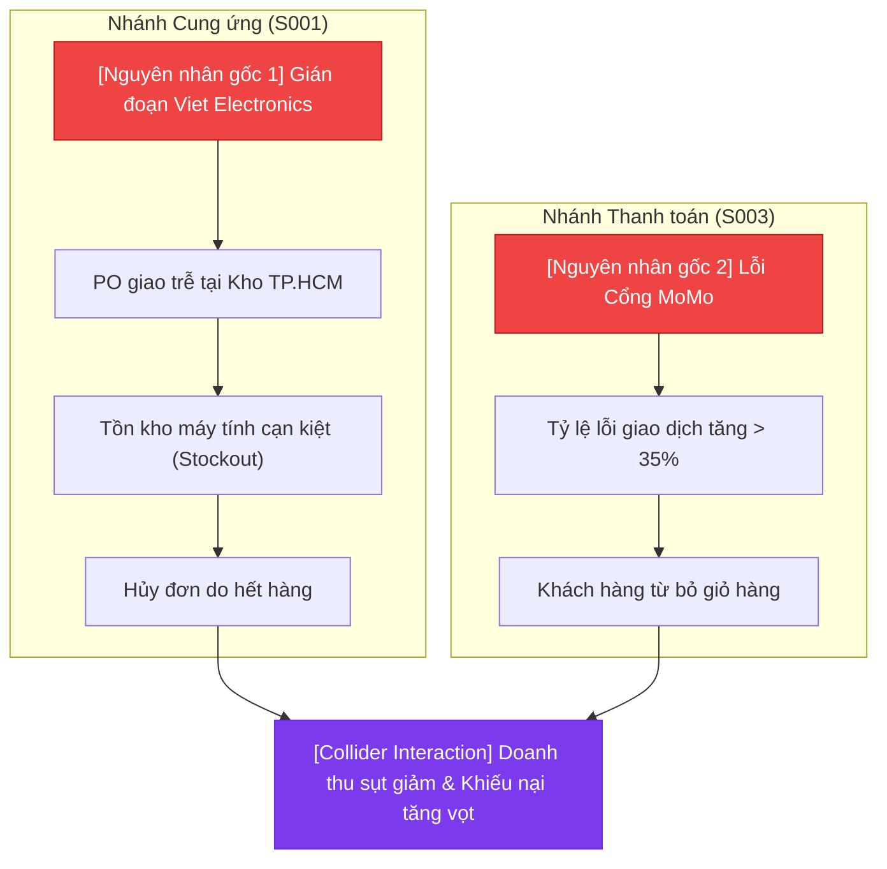
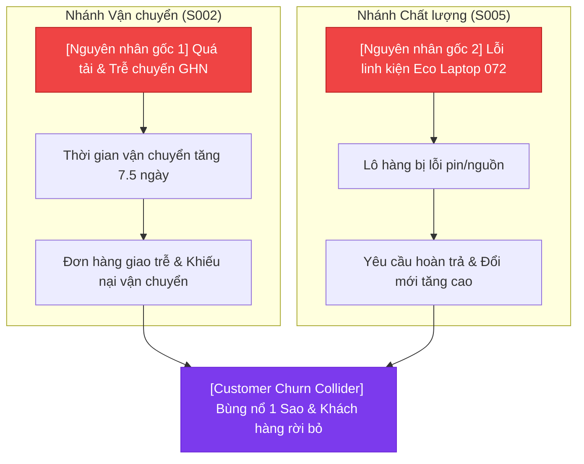

# Enterprise Digital Twin — Danh mục Kịch bản Sự cố V2 (Scenario Catalog V2)

## 1. Tổng quan & Mục tiêu Nâng cấp

Kế thừa từ [scenario_catalog_v1.md](file:///c:/Users/ADMIN/enterprise_digital_twin/docs/scenario_catalog_v1.md) (Mục 9: *Yêu cầu mở rộng trong tương lai*), **Scenario Catalog V2** chuyển đổi hệ thống từ môi trường phòng thí nghiệm sạch sang bản sao số doanh nghiệp thực tế với 4 đặc trưng cốt lõi:

1. **Khủng hoảng Kép & Đa sự cố Đồng thời (Multi-Incident Concurrency)**: Hai hoặc nhiều sự cố xảy ra trong cùng một khoảng thời gian, tác động chồng chéo lên các chỉ số tài chính và vận hành.
2. **Đường cong Cường độ Biến thiên theo Thời gian (Time-Varying Severity Curves)**: Sự cố không xuất hiện theo hàm bước nhảy tức thời (step function) mà trải qua 4 pha:
   - *Pha 1: Incubation (Ủ mầm - 10% đến 20%)*
   - *Pha 2: Escalation (Leo thang - 20% đến 70%)*
   - *Pha 3: Peak Crisis (Đỉnh điểm khủng hoảng - 80% đến 100%)*
   - *Pha 4: Decay & Recovery (Hạ nhiệt & Phục hồi - Giảm dần theo hàm mũ)*
3. **Nhiễu Nghiệp vụ Thực tế (Realistic Business Noise)**:
   - *Độ trễ đồng bộ POS (Asynchronous POS Sync Delay)*: 10-15% giao dịch tại cửa hàng vật lý cập nhật trễ 6 đến 18 giờ.
   - *Nhiễu đánh giá khách hàng (Review Misattribution Noise)*: 3-5% đánh giá 1 sao do bấm nhầm hoặc khiếu nại không liên quan.
   - *Biến động đo lường (Telemetry Metric Jitter)*: Dao động ngẫu nhiên $\pm 3-5\%$ trên các chỉ số tỷ lệ chuyển đổi (CVR), tỷ lệ giao đúng hạn.
4. **Phân bổ Nhân quả Biên (Marginal Causal Attribution)**:
   - Khi hai nguyên nhân $C_1$ và $C_2$ cùng làm sụt giảm doanh thu $L_{total}$, hệ thống Ground Truth và AI Analyst phải lượng hóa chính xác tỷ lệ đóng góp:
     $$L_{total} = L(C_1) + L(C_2) - L(C_1 \cap C_2)$$
   - Ngăn chặn hoàn toàn việc tính trùng lặp tổn thất (Double-counting).

---

## 2. Kịch bản S006 — Cú sốc Kép (The Perfect Storm: Supply Disruption & Payment Outage)

### 2.1. Mô tả Kịch bản
Trong giai đoạn khuyến mãi cao điểm tháng 8/2026, doanh nghiệp đồng thời hứng chịu hai cú sốc:
1. Nhà cung cấp phần cứng máy tính **Viet Electronics** trễ hạn các đơn hàng mua (Purchase Orders) quan trọng, làm cạn kiệt tồn kho của dòng máy tính bán chạy.
2. Cổng thanh toán trực tuyến **MoMo** gặp sự cố kỹ thuật chập chờn, khiến tỷ lệ giao dịch thất bại tăng đột biến từ $5.8\%$ lên hơn $35\%$.

### 2.2. Dấu hiệu Quan sát Bề mặt (Surface Symptoms)
- Tỷ lệ hoàn tất đơn hàng sụt giảm mạnh trên cả kênh Website và Mobile App.
- Tồn kho khả dụng của các sản phẩm điện tử giảm về 0, xuất hiện các đơn hàng bị hủy do hết hàng (Stockout).
- Tỷ lệ thanh toán thất bại tăng vọt cục bộ, kèm theo số lượng giao dịch bị treo (pending).
- Khách hàng gửi vé hỗ trợ khiếu nại song song về việc "sản phẩm hết hàng" và "tiền bị trừ nhưng đơn hàng chưa xác nhận".

### 2.3. Đồ thị Nhân quả Kép (Composite Causal DAG)

### 2.4. Phân bổ Tổn thất Biên (Ground Truth Attribution)
- Tổng doanh thu thất thoát ước tính: **1.780.000.000 VNĐ**
  - Đóng góp từ Đứt gãy Cung ứng: **60.5%** (~1.077.000.000 VNĐ)
  - Đóng góp từ Lỗi Cổng Thanh toán: **39.5%** (~703.000.000 VNĐ)
  - Sai số tương tác (Interaction Offset): Đã khấu trừ các đơn hàng vừa hết hàng vừa lỗi thanh toán.

---

## 3. Kịch bản S007 — Xung đột Vận chuyển & Khiếu nại Chất lượng (Logistics Bottleneck & Hardware Defect)

### 3.1. Mô tả Kịch bản
1. Đơn vị vận chuyển chủ lực **GHN (Giao Hàng Nhanh)** bị quá tải và đình công cục bộ tại khu vực miền Nam, khiến thời gian giao hàng trung bình tăng từ 2 ngày lên 7.5 ngày.
2. Cùng lúc đó, lô hàng **Eco Laptop 072** xuất xưởng bị lỗi dây nguồn và pin, khiến tỷ lệ đổi trả (Return Rate) tăng vọt.

### 3.2. Dấu hiệu Quan sát Bề mặt (Surface Symptoms)
- Tỷ lệ giao hàng đúng hạn (On-Time Delivery Rate) giảm từ $91.5\%$ xuống dưới $62\%$.
- Lượng đánh giá 1 sao (1-Star Reviews) tăng đột biến gấp 5 lần trên hệ thống.
- Báo cáo phản hồi khách hàng bị nhiễu: Nhiều khách hàng đánh giá tiêu cực nhưng ghi nội dung lẫn lộn giữa "hàng hỏng" và "giao quá lâu".
- Điểm CSAT toàn hệ thống sụt giảm nghiêm trọng từ 4.45 xuống 3.12.

### 3.3. Đồ thị Nhân quả Kép

### 3.4. Phân bổ Tổn thất Biên (Ground Truth Attribution)
- Tổng chi phí phát sinh & tổn thất uy tín: **610.000.000 VNĐ**
  - Đóng góp từ Đơn vị Vận chuyển GHN: **30.3%** (~185.000.000 VNĐ tiền bồi hoàn trễ hạn & phạt SLA)
  - Đóng góp từ Lỗi Chất lượng Eco Laptop 072: **69.7%** (~425.000.000 VNĐ chi phí thu hồi, bảo hành & hoàn tiền)

---

## 4. Tiêu chí Đánh giá Benchmark Nâng cao V2

Hệ thống đánh giá sẽ đo lường các thước đo kháng nhiễu và phân rã nguyên nhân:
1. **Multi-Root Identification Accuracy ($\ge 95\%$)**: AI có nhận diện đầy đủ cả 2 nguyên nhân gốc độc lập hay chỉ bắt được 1 nguyên nhân lớn hơn?
2. **Marginal Attribution Error ($\le 10\%$)**: Tỷ lệ phần trăm tổn thất do AI tính toán có lệch quá $10\%$ so với Ground Truth không?
3. **Noise Immunity Rate ($\ge 90\%$)**: AI có bị đánh lừa bởi các dữ liệu trễ hoặc đánh giá 1 sao ngẫu nhiên không?
4. **DAG Collider Detection**: Tác nhân Causal Critic có ngăn chặn được ngộ nhận tương quan ảo và tính trùng lặp không?
